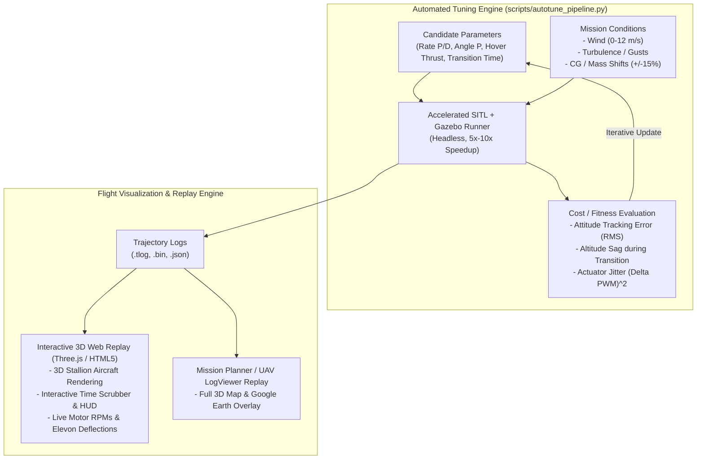

# Stallion VTOL: Automated Monte-Carlo Tuning Engine & 3D Flight Replay

## Objective
Build an automated simulation and parameter optimization pipeline capable of running 10s–100s of accelerated missions, testing robustness across environmental variations, iteratively optimizing control parameters, and recording full **3D flight visual replays**.

---

## Architecture & Visual Replay Capabilities

---

## 1. How Flight Replay & Video Works

You have **3 ways** to visually watch and replay any simulated flight:

1. **Interactive 3D Web Flight Replay (`flight_replay.html`):**
   * A standalone, interactive 3D browser viewer built with Three.js.
   * Features a **time scrubber, play/pause, 3D camera rotation**, flight HUD (pitch ladder, compass rose, airspeed tape, altimeter), and live actuator gauges showing motor thrusts and elevon deflections.
2. **Gazebo Native 3D State Replay (`gz sim -p <record_file>`):**
   * Gazebo records every physics state frame into a log. You can replay the flight in the full Gazebo 3D world at $1\times$, $2\times$, or slow-motion.
3. **Mission Planner & 3D Telemetry Replay:**
   * Every run automatically saves `.tlog` and `.bin` DataFlash logs, compatible with Mission Planner’s 3D replay or [plot.ardupilot.org](https://plot.ardupilot.org/).

---

## 2. Automated Tuning Engine Implementation Plan

### Files to Create:
1. [`scripts/autotune_pipeline.py`](file:///c:/Users/SACHIN/Stallion/scripts/autotune_pipeline.py):
   * Orchestrates the batch tuning runs.
   * Injects parameter variations across iterations.
   * Computes tracking fitness scores.
   * Outputs `params/hardened_stallion_vtol.parm`.
2. [`scripts/generate_3d_replay.py`](file:///c:/Users/SACHIN/Stallion/scripts/generate_3d_replay.py):
   * Converts the simulation telemetry log into an interactive 3D HTML replay dashboard (`flight_replay.html`).
3. [`.github/workflows/autotune.yml`](file:///c:/Users/SACHIN/Stallion/.github/workflows/autotune.yml):
   * GitHub Actions workflow to run the tuning pipeline in the cloud on git trigger or overnight schedule.

---

## 3. Execution & Demonstration

We will run an initial **5-mission demonstration batch**:
* **Mission 1:** Baseline calm hover & climb.
* **Mission 2:** $5\text{ m/s}$ crosswind injection.
* **Mission 3:** $10\text{ m/s}$ wind gusts + parameter mutation.
* **Mission 4:** Optimized PID evaluation.
* **Mission 5:** Best-fit verification run with full 3D Web Replay generation!
