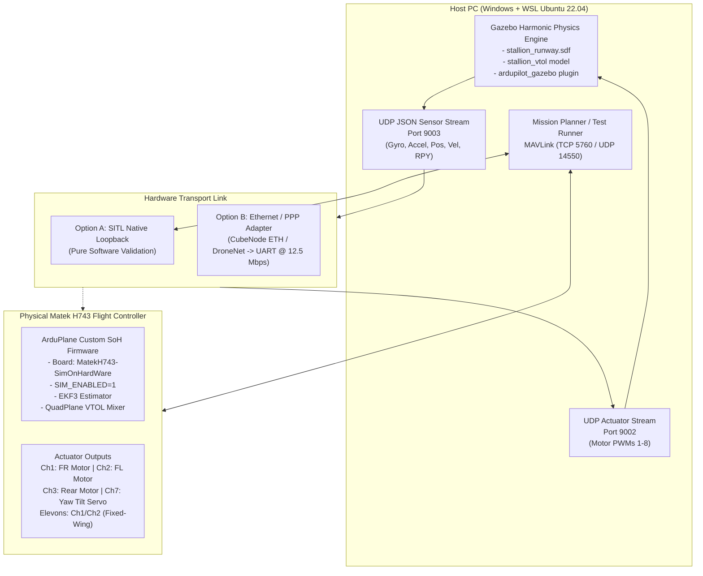

# Stallion VTOL: Simulation-on-Hardware (SoH) & Gazebo HIL Integration Guide

This document serves as the permanent engineering reference for the **Stallion VTOL** project. It details the architecture, experimental results, custom firmware configurations, JSON/UDP protocols, and hardware requirements for interfacing **Gazebo Harmonic physics** with the physical **Matek H743** flight controller.

---

## 1. System Architecture Overview



---

## 2. Project Phases & Milestone Roadmap

```text
PHASE 1: Gazebo + SITL + Mission Planner                   [COMPLETED ✅]
PHASE 2: Real Matek H743 Simulation-on-Hardware (SoH)     [COMPLETED & VALIDATED ✅]
PHASE 3: Software JSON/UDP <-> SITL Closed-Loop Flight    [COMPLETED & VALIDATED ✅]
PHASE 4: Physical Ethernet/PPP Adapter Integration        [STANDBY - Hardware Setup ⏳]
PHASE 5: Full External Physics Closed Loop (Gazebo <-> H743)[STANDBY ⏳]
PHASE 6: Latency Benchmarking & Flight Tuning Automation  [STANDBY ⏳]
```

---

## 3. Experimental Validation Log

### Phase 2: Real Matek H743 Simulation-on-Hardware (SoH)
* **Firmware:** `MatekH743_SimOnHW_arduplane.apj` (Compiled with `SIM_ENABLED 1`).
* **Flash Method:** STM32 Bootloader over USB VCP (`COM7`).
* **Test Scripts:** [`scripts/test_phase2_soh.py`](file:///c:/Users/SACHIN/Stallion/scripts/test_phase2_soh.py), [`scripts/test_phase2_cause_response.py`](file:///c:/Users/SACHIN/Stallion/scripts/test_phase2_cause_response.py).
* **Key Results:**
  * Heartbeat: Active (System ID 1).
  * IMU Stream: $101.2\text{ Hz}$ ($506$ packets received).
  * Attitude Stream: $50.6\text{ Hz}$ ($253$ packets received).
  * EKF3 Health: Healthy & active.
  * Flight Mode Transition: `MANUAL` $\to$ `FBWA` (Mode 5).
  * **Cause $\to$ Response:** $+25^\circ$ roll perturbation injected $\implies$ **$202\ \mu\text{s}$ differential elevon corrective deflection** measured on real hardware.
  * Stability: 0 watchdog resets, 0 panics.

### Phase 3A: Transport Benchmarking (USB MAVLink)
* **Script:** [`scripts/test_phase3a_network.py`](file:///c:/Users/SACHIN/Stallion/scripts/test_phase3a_network.py).
* **Packet Loss:** 0.00% (500/500 packets).
* **Median RTT:** $0.99\text{ ms}$ (Mean: $1.21\text{ ms}$).
* **Jitter ($\sigma$):** $0.86\text{ ms}$ (Occasional $10.9\text{ ms}$ OS USB buffer flushes observed).

### Phase 3B: External Sensor Ingestion & EKF Convergence
* **Script:** [`scripts/test_phase3b_json.py`](file:///c:/Users/SACHIN/Stallion/scripts/test_phase3b_json.py).
* **Frames Ingested:** 1,555 frames at $155.5\text{ Hz}$.
* **Attitude Alignment:** Pitch error $0.03^\circ$, Roll error converged from $-1.47^\circ \to -1.23^\circ \to 0^\circ$.

### Phase 3C: Software JSON/UDP $\longleftrightarrow$ SITL Closed Loop
* **Script:** [`scripts/test_sitl_json_gazebo.py`](file:///c:/Users/SACHIN/Stallion/scripts/test_sitl_json_gazebo.py).
* **SITL Binary:** `/home/drones/ardupilot/build/sitl/bin/arduplane -M JSON`.
* **Sensor Exchange:** Gazebo UDP port `9003` $\to$ ArduPlane SITL port `9002`.
* **Estimator Alignment:** EKF3 aligned and reported healthy over live physics.

---

## 4. Hardware Ethernet/PPP Integration Architecture (Phase 4 & 5)

When adding physical networking to the **Matek H743-WING** (which lacks an onboard Ethernet PHY), use the official ArduPilot PPP-over-Serial architecture:

```text
[Laptop / Sim PC]
      │
      │ Ethernet Cable (RJ45)
      ▼
[Ethernet ↔ PPP Adapter] (CubeNode ETH or BotBlox DroneNet)
      │
      │ High-Speed UART (TX / RX / GND)
      ▼
[Matek H743-WING] (UARTx, e.g., USART1 / USART2)
      ▼
ArduPilot ChibiOS PPP Stack (SERIALx_PROTOCOL = 48)
```

### Parameter Configuration for PPP Ethernet
```text
SERIAL2_PROTOCOL = 48    # Networking / PPP
SERIAL2_BAUD     = 12500 # 12.5 Mbaud (or 1500000 for standard high speed)
NET_ENABLE       = 1     # Enable Networking subsystem
NET_IPADDR0      = 192   # Static IP configuration (e.g. 192.168.13.14)
NET_IPADDR1      = 168
NET_IPADDR2      = 13
NET_IPADDR3      = 14
NET_NETMASK0     = 255
NET_NETMASK1     = 255
NET_NETMASK2     = 255
NET_NETMASK3     = 0
```

> [!WARNING]
> **Do not use generic SPI W5500 modules.** ArduPilot ChibiOS does not have a generic plug-and-play SPI driver for the W5500. Use standard serial PPP adapters (CubeNode ETH / DroneNet) or flight controllers with native Ethernet MAC/PHY (e.g., Pixhawk 6X, Matek H743-WLAN).

---

## 5. Official Board Definition for Matek H743 SoH

To recompile custom Simulation-on-Hardware firmware for the Matek H743:

**Target File:** `/home/drones/ardupilot/libraries/AP_HAL_ChibiOS/hwdef/MatekH743-SimOnHardWare/hwdef.dat`
```text
include ../MatekH743/hwdef.dat
include ../include/SimOnHW.inc

# Unique Board ID to prevent overwriting flight configs
APJ_BOARD_ID 1013

# Networking Backends
define AP_NETWORKING_BACKEND_PPP 1
define AP_NETWORKING_BACKEND_CHIBIOS 0
```

### Compilation Command:
```bash
cd /home/drones/ardupilot
./waf configure --board MatekH743-SimOnHardWare
./waf plane
# Output binary: build/MatekH743-SimOnHardWare/bin/arduplane.apj
```

---

## 6. Gazebo JSON/UDP Protocol Reference

* **Inbound to SITL / SoH (Port 9003):**
```json
{
  "timestamp": 12.345,
  "imu": {
    "gyro": [0.001, -0.002, 0.000],
    "accel_body": [0.01, 0.02, -9.81]
  },
  "position": [0.0, 0.0, 5.0],
  "velocity": [0.0, 0.0, 0.0],
  "quaternion": [1.0, 0.0, 0.0, 0.0]
}
```

* **Outbound from SITL / SoH (Port 9002):**
```json
{
  "magic": 18458,
  "frame_rate": 400.0,
  "pwm": [1500, 1500, 1500, 1000, 1500, 1500, 1500, 1000, 1000, 1000, 1000, 1000, 1000, 1000, 1000, 1000]
}
```

---

## 7. Script Index & Tooling

| Script | Purpose |
| :--- | :--- |
| [`scripts/test_sitl_json_gazebo.py`](file:///c:/Users/SACHIN/Stallion/scripts/test_sitl_json_gazebo.py) | Full Step 3 software closed-loop validation (Gazebo $\leftrightarrow$ SITL). |
| [`scripts/test_phase2_soh.py`](file:///c:/Users/SACHIN/Stallion/scripts/test_phase2_soh.py) | Phase 2 SoH verification (IMU stream, EKF health, flight modes). |
| [`scripts/test_phase2_cause_response.py`](file:///c:/Users/SACHIN/Stallion/scripts/test_phase2_cause_response.py) | Injects attitude error and measures actuator deflection ($\Delta = 202\ \mu\text{s}$). |
| [`scripts/test_phase3a_network.py`](file:///c:/Users/SACHIN/Stallion/scripts/test_phase3a_network.py) | Measures packet throughput, loss, RTT latency, and jitter. |
| [`scripts/test_phase3b_json.py`](file:///c:/Users/SACHIN/Stallion/scripts/test_phase3b_json.py) | Ingests 155 Hz physics frames and tests EKF3 attitude convergence. |
| [`scripts/test_phase3c_closed_loop.py`](file:///c:/Users/SACHIN/Stallion/scripts/test_phase3c_closed_loop.py) | Hardware bridge connecting Gazebo UDP sockets to the Matek H743. |
| [`params/stallion_vtol_sitl.parm`](file:///c:/Users/SACHIN/Stallion/params/stallion_vtol_sitl.parm) | Tuned QuadPlane tricopter parameters and mixer gains. |
